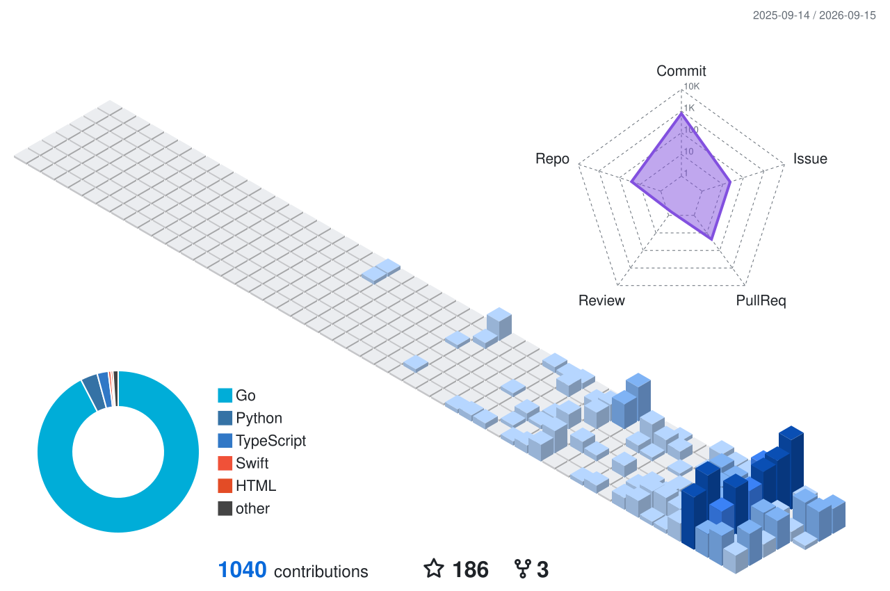

<!--
  mreza0100 — profile README.
  Every visual here is generated inside this repo by GitHub Actions with the default
  GITHUB_TOKEN and served as a static SVG: no rented widget instances that can 503.
    assets/header-*.svg          hand-written animated SVG (liquid glass, no libraries)
    assets/stats-*.svg           scripts/stats.mjs   -> .github/workflows/stats.yml
    profile-3d-contrib/*.svg     3d-contrib action   -> .github/workflows/3d.yml
    assets/snake-*.svg           Platane/snk         -> .github/workflows/snake.yml
  Theme-aware via <picture> + prefers-color-scheme. Edit content between the cards, not the cards.
-->

<picture>
  <source media="(prefers-color-scheme: dark)" srcset="assets/header-dark.svg">
  
</picture>

 

**Backend & infrastructure engineer** at Booking.com · The Netherlands 
I build the machinery — services, agent tooling, and the odd shader when nobody's looking.

---

### `~ $ whoami`

- 🛠  **Backend & distributed systems** — Go and Rust for the hot paths, Python and TypeScript for everything around them.
- 🤖  **Agent tooling** — I build developer tools on top of Claude Code: pipelines, research engines, and fleet management for AI coding sessions.
- 🧪  **Curious to a fault** — a WebGL glass shader, an EU-AI-Act validator, a Brainfuck interpreter. If it's interesting, it gets built.
- 📫  Reach me on [LinkedIn](https://www.linkedin.com/in/reza-khosravivala/).

 

### 🧰 Tech I reach for

<picture>
  <source media="(prefers-color-scheme: dark)" srcset="https://skillicons.dev/icons?i=go%2Crust%2Cpython%2Cts%2Cjs%2Cswift%2Cdocker%2Ckubernetes%2Cpostgres%2Credis%2Ccassandra%2Cgraphql%2Caws%2Clinux%2Cnginx%2Cbash&perline=8&theme=dark">
  
</picture>

 

### 📌 Featured work

<table>
<tr>
<td width="50%" valign="top">

#### 📄 [resume101](https://github.com/mreza0100/resume101) · ⭐ 135
An opinionated resume guide for experienced software engineers. My most-starred project by a wide margin.
 `Guide` · `Career`

</td>
<td width="50%" valign="top">

#### 🎓 [professor](https://github.com/mreza0100/professor) · Go
Turns Claude Code into a senior engineering team — pipeline, QA gates, and a `pfm` CLI that manages every AI coding chat on your machine.
 `Go` · `Claude Code` · `Agents`

</td>
</tr>
<tr>
<td width="50%" valign="top">

#### 🌫 [liquid-glass](https://github.com/mreza0100/liquid-glass) · WebGL
Zero-dependency liquid-glass effect — smoke refracted through a bevelled glass slab, every parameter a live knob. [Live demo »](https://mreza0100.github.io/liquid-glass/)
 `WebGL` · `GLSL` · `Zero-deps`

</td>
<td width="50%" valign="top">

#### 🧩 [gemini-coax](https://github.com/mreza0100/gemini-coax) · Python
Makes Google Gemini structured output actually validate against your Pydantic models — fixes the `anyOf`/enum drop and ignored bounds.
 `Python` · `Pydantic` · `LLM`

</td>
</tr>
<tr>
<td width="50%" valign="top">

#### 🧵 [loom](https://github.com/mreza0100/loom) · Rust
AI code intelligence via vector search — an MCP server that replaces grep for AI coding tools.
 `Rust` · `MCP` · `Vector search`

</td>
<td width="50%" valign="top">

#### 📊 [limit-dashboard](https://github.com/mreza0100/limit-dashboard) · Swift
Native macOS dashboard for AI subscription limits — Claude, Codex, and Vertex usage in one live, local-only view.
 `Swift` · `SwiftUI` · `macOS`

</td>
</tr>
</table>

 

### 📈 GitHub at a glance

<picture>
  <source media="(prefers-color-scheme: dark)" srcset="assets/stats-dark.svg">
  
</picture>

 

### 🧊 A year of contributions, in 3D

<picture>
  <source media="(prefers-color-scheme: dark)" srcset="profile-3d-contrib/profile-3d-dark.svg">
  
</picture>

 

### 🐍 ...and the snake that eats them

<picture>
  <source media="(prefers-color-scheme: dark)" srcset="assets/snake-dark.svg">
  
</picture>

 

Every graphic on this page is generated in-repo by GitHub Actions and committed as a static SVG — no third-party widget servers to go dark.

